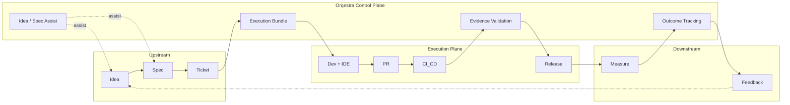

# RFC List to Define for Orqestra

Based on [orqestra.md](../orqestra.md), the following RFCs need to be defined. **RFC-001 is Architecture** (including end-to-end flow) as the foundation; remaining RFCs are numbered sequentially.

---

## End-to-end product flow (to be clarified in RFC-001)

Product flow from a user/system perspective — so that all subsequent RFCs align to a single flow.

**Short narrative:**

1. **Upstream:** PM/Product create Idea → Spec (Confluence/Notion) → Ticket (Jira/Linear). Orqestra reads spec + ticket.  
   **PM/Product ↔ AI or Orqestra at Idea & Spec:** PMs can interact with Orqestra (or an AI layer) *before* a ticket exists: e.g. idea clarification, structured spec drafting, suggested acceptance criteria, and spec completeness checks. That reduces ambiguity early and improves bundle quality. This “Idea / Spec Assist” touchpoint is shown in the diagram; RFC-001 (or a dedicated RFC) can scope it (e.g. chat/copilot in Confluence/Notion, or Orqestra UI).
2. **Bundling:** Control plane produces an **Execution Bundle** (spec + acceptance criteria + context) — input for dev.
4. **Evidence:** Orqestra collects evidence (test results, coverage, CI) → **validates** before human review.
5. **Release & Measure:** PR merge → release → system measures KPI/outcome.
6. **Feedback:** Outcome tracking brings signals back (post-release insights) → feeds into Idea/Spec for the next cycle.

RFC-001 Architecture will formalise this flow (actors, systems, boundaries) and the placement of each component (Context Bundling, Traceability, PR Intelligence, Evidence Sync, Outcome Loop).

---

## 1. Foundation (RFC-001) + Data formats & schemas

| RFC                                          | Purpose                                                                                                                                                                                              |
| -------------------------------------------- | ----------------------------------------------------------------------------------------------------------------------------------------------------------------------------------------------------- |
| [**RFC-001: Architecture & End-to-End Flow**](rfc-001.md)  | Overall architecture (Control vs Execution plane), **end-to-end product flow** (Intent → Execution → Evidence → Outcome → Feedback), actors, system boundaries, and placement of core features in the flow. |
| [**RFC-002: Execution Bundle Schema**](rfc-002.md)         | Define machine-readable schema for execution bundle: structure (spec → tasks, dependencies), versioning, and mapping from product spec.                                                              |
| [**RFC-003: Acceptance Criteria Model**](rfc-003.md)       | Define model for acceptance criteria: structure (ID, description, verification conditions), link to requirement, and format for programmatic verification.                                                      |
| [**RFC-004: Evidence Payload Format**](rfc-004.md)         | Unified format for evidence: test results, coverage reports, CI logs, validation signals; schema and lifecycle (created → validated → linked).                                                   |
| [**RFC-005: KPI & Outcome Definition Schema**](rfc-005.md) | Schema for KPI definitions and outcome signals: metric type, aggregation, link to release artifacts and post-release insights.                                                                         |

---

## 2. Control Plane

| RFC                                                                | Purpose                                                                                                                                                 |
| ------------------------------------------------------------------ | -------------------------------------------------------------------------------------------------------------------------------------------------------- |
| [**RFC-006: Control Plane API**](rfc-006.md)                                     | Control plane API surface: context synthesis, execution planning, evidence validation, workflow orchestration, outcome tracking; auth and versioning. |
| [**RFC-007: Intent → Execution → Evidence → Outcome State Machine**](rfc-007.md) | State machine and events for the loop Intent → Execution → Evidence → Outcome → Feedback; transitions and idempotency.                                         |
| [**RFC-008: Context Synthesis Protocol**](rfc-008.md)                            | How to synthesize context from multiple sources (tickets, docs, specs, PR metadata); precedence, merging, and cache/invalidation.                                    |

---

## 3. Integrations

| RFC                                                          | Purpose                                                                                                                       |
| ------------------------------------------------------------ | ------------------------------------------------------------------------------------------------------------------------------ |
| [**RFC-009: Ticket Provider Adapter (Jira / Linear)**](rfc-009.md)         | Contract and adapter for ticket systems: read tickets/specs, write status, link execution bundles and evidence; webhook/polling. |
| [**RFC-010: Document Provider Adapter (Confluence / Notion)**](rfc-010.md)  | Contract for document sources: fetch specs/docs, mapping spec → execution bundle, sync and permissions.                         |
| [**RFC-011: Git Provider Adapter (GitHub / GitLab)**](rfc-011.md)           | Contract for Git: PR metadata, code diffs, branch/tag, link PR ↔ ticket ↔ evidence; webhooks and API usage.                    |
| [**RFC-012: CI/CD & Test Integration**](rfc-012.md)                        | How to receive test results, coverage, CI logs from pipelines; push vs pull, format (RFC-004), and linking to PR/bundle.              |
| [**RFC-013: IDE / Agent Integration**](rfc-013.md)                         | Interface with VSCode, Cursor, JetBrains: how IDE/agent receives execution bundle, submits evidence, and syncs context.               |

---

## 4. Core features (technical design)

| RFC                                            | Purpose                                                                                                                                         |
| ---------------------------------------------- | ------------------------------------------------------------------------------------------------------------------------------------------------ |
| [**RFC-014: Context Bundling Engine**](rfc-014.md)           | Detail the engine that converts spec → execution bundle: input (spec + tickets), output (RFC-002), rules, idempotency, and when to re-bundle.              |
| [**RFC-015: Acceptance Criteria Traceability**](rfc-015.md)  | How to map acceptance criteria (RFC-003) to code diffs and test coverage; storage, query API, and UI contract for traceability view.               |
| [**RFC-016: PR Intelligence Layer**](rfc-016.md)             | PR summaries, risk flags, evidence validation before review: input (PR + evidence + criteria), output format, and integration with review workflow. |
| [**RFC-017: Evidence Sync Engine**](rfc-017.md)              | Collect and sync evidence from tests, coverage, CI into a unified view; sources (RFC-012), storage, dedup, and link to PR/bundle.                  |
| [**RFC-018: Workflow Latency Reduction**](rfc-018.md)        | Mechanisms to reduce clarification loops and handoff friction: notifications, context handoff format, and role-based (PM/Dev/QA/Reviewer) flows.            |
| [**RFC-019: Outcome Feedback Loop**](rfc-019.md)             | Connect release artifacts → KPI (RFC-005): release identification, metric collection, attribution, and post-release insight format.               |

---

## 5. Additional (Security, Scale, Observability)

| RFC                                          | Purpose                                                                                              |
| -------------------------------------------- | ----------------------------------------------------------------------------------------------------- |
| [**RFC-020: Auth, Tenancy & Data Isolation**](rfc-020.md)   | Authentication, authorization, multi-tenancy, and data isolation between teams/orgs.                   |
| [**RFC-021: Observability & Audit**](rfc-021.md)            | Logging, metrics, tracing for the control plane; audit trail for intent → execution → evidence → outcome. |

---

## Implementation

- **Phase 1 (foundation):** **RFC-001 Architecture & End-to-End Flow** first, then RFC-002, RFC-003, RFC-004, RFC-006, RFC-007.
- **Phase 2 (integrations):** RFC-009, RFC-010, RFC-011, RFC-012, RFC-013.
- **Phase 3 (features):** RFC-014 → RFC-019.
- **Phase 4:** RFC-005, RFC-008, RFC-020, RFC-021.

Once RFC-001 is done, the end-to-end flow is clear; subsequent RFCs reference it.
