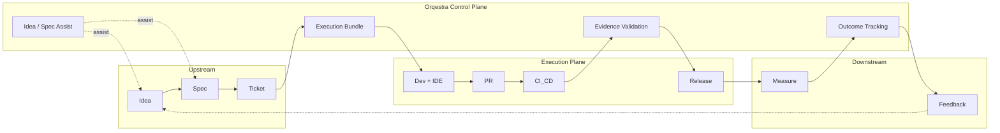

# RFC-001: Architecture & End-to-End Flow

**Status:** Draft  
**Summary:** Defines Orqestra’s overall architecture (Control vs Execution plane), the end-to-end product flow (Intent → Execution → Evidence → Outcome → Feedback), actors, system boundaries, and the placement of core features in the flow.

---

## 1. Overview

This RFC establishes the architectural foundation for Orqestra. It does not define APIs, schemas, or integration contracts (those are covered by later RFCs). It does:

- Separate **Control Plane** (Orqestra) from **Execution Plane** (existing tools).
- Define the **end-to-end product flow** and the loop Intent → Execution → Evidence → Outcome → Feedback.
- Identify **actors** and **system boundaries**.
- Map **core features** (including Idea/Spec Assist) onto the flow so subsequent RFCs can reference a single, consistent picture.

---

## 2. Architecture Model: Two Planes

Orqestra is a **control plane**. It does not replace development tools, project management, or code editors; it **orchestrates** them.

### 2.1 Control Plane (Orqestra)

**Role:** Manage intent, coordination, validation, and outcome tracking.

**Operates over:**

- Tickets (Jira / Linear)
- Documents (Confluence / Notion)
- Specifications
- PR metadata
- Execution bundles
- KPI definitions

**Responsibilities:**

- Context synthesis
- Execution planning (e.g. producing execution bundles)
- Evidence validation (before human review)
- Workflow orchestration
- Outcome tracking

**Boundary:** The Control Plane does not write code, run tests, or deploy. It reads from and writes to external systems via adapters (see RFC-009–013).

### 2.2 Execution Plane

**Role:** Where implementation and delivery happen.

**Includes:**

- Code editors (VSCode, Cursor, JetBrains)
- Git repositories (GitHub / GitLab)
- CI/CD pipelines
- Test frameworks
- Observability systems

**Responsibilities:**

- Code generation and implementation
- Test execution
- Evidence generation (test results, coverage, CI logs)
- PR submission and merge
- Release and deployment

**Boundary:** The Execution Plane is not owned by Orqestra. Orqestra **coordinates and validates** it (e.g. by supplying execution bundles and consuming evidence).

### 2.3 Diagram: Planes and flow



---

## 3. End-to-End Product Flow

The core loop is:

```
Intent → Execution → Evidence → Outcome → Feedback
```

Below is the same loop expressed as a staged product flow with six steps.

### 3.1 Step-by-step flow

| Step | Name | Description |
|------|------|-------------|
| 1 | **Upstream** | PM/Product create Idea → Spec (Confluence/Notion) → Ticket (Jira/Linear). Orqestra reads spec + ticket. Optionally, PM/Product interact with Orqestra or AI at Idea/Spec (see §4.1). |
| 2 | **Bundling** | Control plane produces an **Execution Bundle** (spec + acceptance criteria + context) — structured input for dev (RFC-002). |
| 3 | **Execution** | Dev (IDE/agent) implements from bundle → opens PR → CI runs tests/coverage. Execution Plane only. |
| 4 | **Evidence** | Orqestra collects evidence (test results, coverage, CI logs) and **validates** it before human review. |
| 5 | **Release & Measure** | PR merge → release → system measures KPI/outcome. |
| 6 | **Feedback** | Outcome tracking brings signals back (post-release insights) → feeds into Idea/Spec for the next cycle. |

### 3.2 Flow properties

- **Traceability:** Each step can be linked: Ticket ↔ Bundle ↔ PR ↔ Evidence ↔ Release ↔ Outcome (detailed in RFC-014, RFC-015, RFC-019).
- **Single source of flow:** All other RFCs (API, state machine, integrations, features) align to this flow and these boundaries.

---

## 4. Actors and Touchpoints

### 4.1 Actors

| Actor | Primary interaction with Orqestra | Stage(s) |
|-------|-----------------------------------|----------|
| **PM / Product** | Idea/Spec Assist (optional), spec/ticket as input to bundling | Upstream, Feedback |
| **Developer** | Receives execution bundle; works in IDE; opens PR | Execution |
| **QA** | Uses evidence and traceability; may validate against criteria | Evidence, Execution |
| **Reviewer** | Receives PR intelligence (summaries, risk, evidence status) before review | Evidence |
| **System / Automation** | CI, Git, ticket/docs providers; Orqestra syncs and validates | All |

### 4.2 PM/Product ↔ Orqestra at Idea & Spec (Idea / Spec Assist)

PMs can interact with Orqestra (or an AI layer) **before** a ticket exists:

- Idea clarification
- Structured spec drafting
- Suggested acceptance criteria
- Spec completeness checks

This reduces upstream ambiguity and improves execution bundle quality. The touchpoint is shown in the diagram as **Idea / Spec Assist**. Scoping (e.g. chat/copilot in Confluence/Notion vs Orqestra UI) may be part of RFC-001 follow-up or a dedicated RFC.

---

## 5. System Boundaries

| Boundary | In scope (Orqestra) | Out of scope (Execution / external) |
|----------|---------------------|--------------------------------------|
| **Data** | Execution bundles, evidence payloads, trace links, KPI definitions | Source code, runtime config, infra definitions |
| **Computation** | Context synthesis, bundling, validation, outcome aggregation | Builds, test runs, deployments |
| **User interface** | Orqestra UI for bundles, evidence, traceability, outcomes; optional PM assist UI | IDE, Jira/Linear, Confluence/Notion, GitHub/GitLab native UIs |
| **Integrations** | Adapters to tickets, docs, Git, CI, IDE (read/write metadata and links) | Orqestra does not host Git, run CI, or edit code |

---

## 6. Placement of Core Features in the Flow

Orqestra’s six core features (from [orqestra.md](../orqestra.md)) plus Idea/Spec Assist are placed as follows. Each will be detailed in a later RFC.

| Feature | Placement in flow | RFC |
|---------|-------------------|-----|
| **Idea / Spec Assist** | Upstream (Idea, Spec); optional PM ↔ Orqestra/AI | This RFC; optional dedicated RFC |
| **Context Bundling Engine** | Ticket → Execution Bundle; input for Execution | RFC-014 |
| **Acceptance Criteria Traceability** | Criteria ↔ code diffs, test coverage; across Bundling → Evidence | RFC-015 |
| **PR Intelligence Layer** | Evidence stage; before human review | RFC-016 |
| **Evidence Sync Engine** | Execution → Orqestra; unified evidence view | RFC-017 |
| **Workflow Latency Reduction** | Cross-stage; handoffs PM → Dev → QA → Reviewer | RFC-018 |
| **Outcome Feedback Loop** | Release → Measure → Outcome → Feedback | RFC-019 |

---

## 7. References

- [orqestra.md](../orqestra.md) — Product context, problem statement, Control/Execution planes, core features.
- [rfc-000.md](rfc-000.md) — RFC list, end-to-end flow diagram, suggested RFC order.
- **Next RFCs:** RFC-002 (Execution Bundle Schema), RFC-006 (Control Plane API), RFC-007 (State machine).
