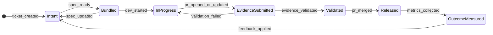

# RFC-007: Intent → Execution → Evidence → Outcome State Machine

**Status:** Draft  
**Summary:** Defines the state machine and events for the loop Intent → Execution → Evidence → Outcome → Feedback; transitions and idempotency.

---

## 1. Overview

The product flow (RFC-001) is implemented as a state machine so that orchestration, validation, and handoffs can be driven by events and transitions. This RFC defines the main states, transitions, and events, and how idempotency and retries are handled.

**In scope:**

- States and allowed transitions (with optional mermaid diagram).
- Events that trigger transitions.
- Idempotency and retry behavior.

**Out of scope:**

- API surface for emitting or querying state (RFC-006).
- Detailed integration contracts (RFC-009–013).

---

## 2. State machine

### 2.1 States and transitions

The unit of the state machine can be **per ticket** or **per ticket+PR** (e.g. one ticket with multiple PRs has one “ticket” state and optional “per-PR” sub-states). Below is a simplified model; concrete state names can be adjusted.

- **Intent:** Ticket (and optionally spec) exists; not yet bundled.
- **Bundled:** Execution bundle produced; ready for dev.
- **InProgress:** Dev working (e.g. PR open, not yet validated).
- **EvidenceSubmitted:** Evidence received; pending validation.
- **Validated:** Evidence validated (pass/fail); ready for review/merge.
- **Released:** PR merged; release cut.
- **OutcomeMeasured:** Outcomes/KPIs recorded for this release.
- **Feedback applied** closes the loop (e.g. insights fed back to product); next cycle may start at Intent.

Transitions can be triggered by external events (webhooks from Git, CI, tickets) or by internal actions (e.g. “validate evidence”).

### 2.2 Events

Examples of events that drive transitions:

- `ticket_created`, `ticket_updated`, `spec_updated` — from ticket/docs adapters (RFC-009, RFC-010).
- `spec_ready` — internal or manual: spec and ticket ready for bundling.
- `dev_started` — e.g. bundle fetched by IDE (RFC-013) or PR created.
- `pr_opened`, `pr_updated`, `pr_merged` — from Git adapter (RFC-011).
- `evidence_received` — from CI/test integration (RFC-012); may transition to EvidenceSubmitted.
- `evidence_validated` — after Control Plane runs validation (RFC-016, RFC-017).
- `metrics_collected` — after outcome pipeline runs (RFC-019).

Events should carry minimal payload (ids, timestamps); full data is fetched by the Control Plane as needed.

### 2.3 Idempotency and retries

- **Idempotency:** Processing the same event (e.g. same `event_id` or `(source, id)` tuple) twice should not duplicate state changes. Store processed event ids and skip or no-op on duplicate.
- **Retries:** Failed transitions (e.g. adapter timeout) can be retried with exponential backoff. Events remain in a “pending” or “failed” state until processed or dead-lettered.
- **Re-bundle:** When spec or ticket is updated after Bundled, a transition back to Intent or a “re-bundle” transition can produce a new bundle version (RFC-014) and keep the state machine consistent.

---

## 3. References

- [rfc-000.md](rfc-000.md) — RFC list.
- [RFC-001: Architecture & End-to-End Flow](rfc-001.md) — End-to-end flow and loop.
- [RFC-006: Control Plane API](rfc-006.md) — API that may emit or query state.
